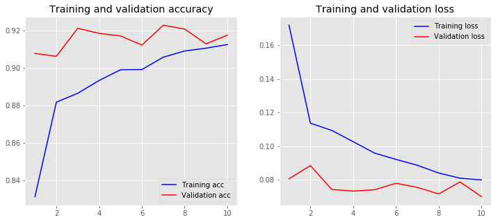
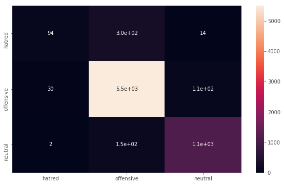
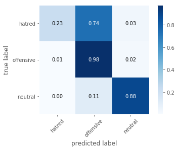
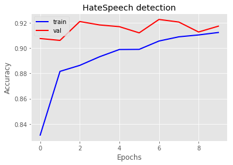
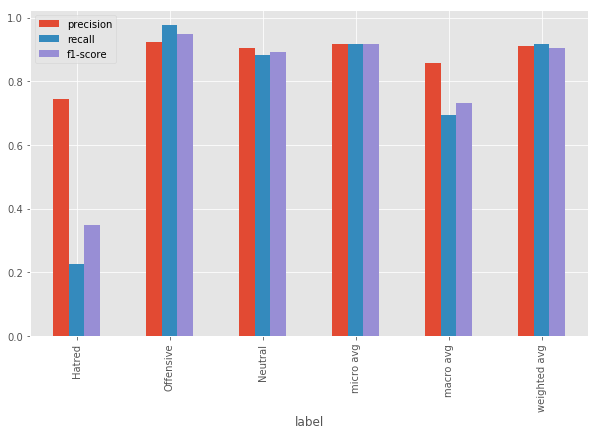

# Hate-Speech Detection From Social Media Post

The aim of this project is to detect or identify hate-speech from the social media post like facebook and twiiter.In this model pre trained word embeddings(using FastText) is used on the keras sequential model.The initial dataset was collected from ( github.com/t-davidson/hate-speech-and-offensive-language).Using FastText cbow model word vectors were created from the dataset.Then this vector file is feeded to the keras model..As the vec file is too large it could not be uploaded.But using fastetext is not a big deal.You can easily create this.

For using fastetext please refer to:::https://pypi.org/project/fasttext-win/ and for mac os and linux :::https://fasttext.cc/

caution::: for using fasttext in windows, It requires Cython in order to build the C++ extension.

So without further ado..let's get started.


# importing all the necessary packages


```python
import numpy as np
import pandas as pd


import keras
from keras import optimizers
from keras import backend as K
from keras import regularizers
from keras.models import Sequential
from keras.layers import Dense, Activation, Dropout, Flatten
from keras.layers import Embedding, Conv1D, MaxPooling1D, GlobalMaxPooling1D 
from keras.utils import plot_model
from keras.preprocessing import sequence
from keras.preprocessing.text import Tokenizer


from tqdm import tqdm
import os, re, csv, math, codecs
```


    

# Loading the pre trained word embedding file
A pre trained word embedding file was created using fasttext earlier and that vector file will be loaded here


```python

print('loading word embeddings...')
embeddings_index = {}
f = codecs.open('model_new.vec', encoding='utf-8')
for line in tqdm(f):
    values = line.rstrip().rsplit(' ')
    word = values[0]
    coefs = np.asarray(values[1:], dtype='float32')
    embeddings_index[word] = coefs
f.close()
print('found %s word vectors' % len(embeddings_index))
```

    loading word embeddings...
    

    36084it [00:01, 19432.74it/s]
    

    found 36084 word vectors
    

# Loading Training and Test data

The initial dataset was split into two dataset namely final_train.csv and final_test.csv.That part of the code is not added here.But that is not much of a work.Hopefuly you can done it by your own according to your need. 


```python
train_df = pd.read_csv('final_train.csv')
test_df = pd.read_csv('final_test.csv')


print("num train: ", train_df.shape[0])
print("num test: ", test_df.shape[0])
```

    num train:  17433
    num test:  7350
    

# Accesing Class values
The dataset has 3 class labelled as 0,1 and 2 which corresponds to hatred,offensive and neutral respectively.The class label valuse will be accesed from the dataframe and will be saved in the y_train and y_test variables


```python
class_label=['class']
y_train = train_df[class_label].values
y_test = test_df[class_label].values

```

# Pre-processing

Here we will use nltk stopwords in order to remove stopwords from the training and testing dataset.Then the words will tokenized and will be saved in a list.Finally the pad_sequence will be applied so that they will be in same length


```python
from nltk.corpus import stopwords
from nltk.tokenize import RegexpTokenizer 


stop_words = set(stopwords.words('english'))
stop_words.update(['.', ',', '"', "'", ':', ';', '(', ')', '[', ']', '{', '}'])

MAX_NB_WORDS = len(embeddings_index)
tokenizer = RegexpTokenizer(r'\w+')
raw_docs_train = train_df['clean_tweet'].tolist()
raw_docs_test = test_df['clean_tweet'].tolist() 
num_classes = len(class_label)
print(num_classes)
print("pre-processing train data...")
processed_docs_train = []
for doc in tqdm(raw_docs_train):
    tokens = tokenizer.tokenize(doc)
    filtered = [word for word in tokens if word not in stop_words]
    processed_docs_train.append(" ".join(filtered))
processed_docs_test = []
for doc in tqdm(raw_docs_test):
    tokens = tokenizer.tokenize(doc)
    filtered = [word for word in tokens if word not in stop_words]
    processed_docs_test.append(" ".join(filtered))


print("tokenizing input data...")
tokenizer = Tokenizer(num_words=MAX_NB_WORDS, lower=True, char_level=False)
tokenizer.fit_on_texts(processed_docs_train + processed_docs_test)  #leaky
word_seq_train = tokenizer.texts_to_sequences(processed_docs_train)
word_seq_test = tokenizer.texts_to_sequences(processed_docs_test)
word_index = tokenizer.word_index
print("dictionary size: ", len(word_index))


#pad sequences
word_seq_train = sequence.pad_sequences(word_seq_train, maxlen=100)
word_seq_test = sequence.pad_sequences(word_seq_test, maxlen=100)


```

    1
    pre-processing train data...
    

    100%|████████████████████████████████████████████████████████████████████████| 17433/17433 [00:00<00:00, 137586.09it/s]
    100%|██████████████████████████████████████████████████████████████████████████| 7350/7350 [00:00<00:00, 141622.00it/s]
    

    tokenizing input data...
    dictionary size:  22505
    

### processed words are matched with the embedded file to get the assigned vector value of the respective word


```python
num_words = len(word_index) + 1
embedd = np.zeros((num_words,100))

for word , i in word_index.items():
    if i > num_words:
        continue
    embedd_vec = embeddings_index.get(word)
    if embedd_vec is not None:
        embedd[i] = embedd_vec     
print(num_words)
```

    22506
    

# Initializing Training and Model Parameters


```python
#training params
batch_size = 64 
num_epochs = 10

#model parameters
num_filters = 64 
embed_dim = 100 

```

# keras sequential model 
keras sequential model is initialized and added embedded words as the embedding layer.Relu is used as the activaton function.


```python
print("training CNN ...")
model = Sequential()
model.add(Embedding(num_words, embed_dim,
          weights=[embedd], input_length=100, trainable=False))
model.add(Conv1D(num_filters, 7, activation='relu', padding='same'))
model.add(MaxPooling1D(2))
model.add(Conv1D(num_filters, 7, activation='relu', padding='same'))
model.add(Conv1D(num_filters, 7, activation='relu', padding='same'))
model.add(Conv1D(num_filters, 7, activation='relu', padding='same'))
model.add(GlobalMaxPooling1D())
model.add(Dropout(0.5))
model.add(Dense(num_classes, activation='relu'))  

model.compile(loss='mean_squared_error', optimizer='adam', metrics=['accuracy'])
model.summary()
```

    training CNN ...
    _________________________________________________________________
    Layer (type)                 Output Shape              Param #   
    =================================================================
    embedding_1 (Embedding)      (None, 100, 100)          2250600   
    _________________________________________________________________
    conv1d_1 (Conv1D)            (None, 100, 64)           44864     
    _________________________________________________________________
    max_pooling1d_1 (MaxPooling1 (None, 50, 64)            0         
    _________________________________________________________________
    conv1d_2 (Conv1D)            (None, 50, 64)            28736     
    _________________________________________________________________
    conv1d_3 (Conv1D)            (None, 50, 64)            28736     
    _________________________________________________________________
    conv1d_4 (Conv1D)            (None, 50, 64)            28736     
    _________________________________________________________________
    global_max_pooling1d_1 (Glob (None, 64)                0         
    _________________________________________________________________
    dropout_1 (Dropout)          (None, 64)                0         
    _________________________________________________________________
    dense_1 (Dense)              (None, 1)                 65        
    =================================================================
    Total params: 2,381,737
    Trainable params: 131,137
    Non-trainable params: 2,250,600
    _________________________________________________________________
    

# Model training


```python
#model training
hist = model.fit(word_seq_train, y_train, batch_size=batch_size, epochs=num_epochs, validation_data=(word_seq_test, y_test), verbose=2)
```

 
    Train on 17433 samples, validate on 7350 samples
    Epoch 1/10
     - 15s - loss: 0.1719 - acc: 0.8311 - val_loss: 0.0805 - val_acc: 0.9076
    Epoch 2/10
     - 14s - loss: 0.1136 - acc: 0.8816 - val_loss: 0.0884 - val_acc: 0.9061
    Epoch 3/10
     - 14s - loss: 0.1093 - acc: 0.8864 - val_loss: 0.0742 - val_acc: 0.9211
    Epoch 4/10
     - 14s - loss: 0.1026 - acc: 0.8932 - val_loss: 0.0732 - val_acc: 0.9184
    Epoch 5/10
     - 14s - loss: 0.0958 - acc: 0.8989 - val_loss: 0.0740 - val_acc: 0.9170
    Epoch 6/10
     - 14s - loss: 0.0921 - acc: 0.8990 - val_loss: 0.0779 - val_acc: 0.9121
    Epoch 7/10
     - 14s - loss: 0.0886 - acc: 0.9056 - val_loss: 0.0754 - val_acc: 0.9227
    Epoch 8/10
     - 14s - loss: 0.0840 - acc: 0.9090 - val_loss: 0.0715 - val_acc: 0.9207
    Epoch 9/10
     - 14s - loss: 0.0809 - acc: 0.9105 - val_loss: 0.0787 - val_acc: 0.9128
    Epoch 10/10
     - 14s - loss: 0.0798 - acc: 0.9124 - val_loss: 0.0699 - val_acc: 0.9174
    

# Plotting
used matplotlib for plotting.Here a function is defined for plotting accuracy and loss


```python
import matplotlib.pyplot as plt
plt.style.use('ggplot')

def plot_history(history):
    acc = history.history['acc']
    val_acc = history.history['val_acc']
    loss = history.history['loss']
    val_loss = history.history['val_loss']
    x = range(1, len(acc) + 1)

    plt.figure(figsize=(12, 5))
    plt.subplot(1, 2, 1)
    plt.plot(x, acc, 'b', label='Training acc')
    plt.plot(x, val_acc, 'r', label='Validation acc')
    plt.title('Training and validation accuracy')
    plt.legend()
    plt.subplot(1, 2, 2)
    plt.plot(x, loss, 'b', label='Training loss')
    plt.plot(x, val_loss, 'r', label='Validation loss')
    plt.title('Training and validation loss')
    plt.legend()
```

# Evaluting model
Training and Testing accuracy is evaluted and plot_history function has been called for plotting the accurace and loss 


```python
loss, accuracy = model.evaluate(word_seq_train, y_train, verbose=False)
print("Training Accuracy: {:.4f}".format(accuracy))

loss, accuracy = model.evaluate(word_seq_test, y_test, verbose=False)
print("Testing Accuracy:  {:.4f}".format(accuracy))

plot_history(hist)
```

    Training Accuracy: 0.9236
    Testing Accuracy:  0.9174
    





# confusion_matrix and Classifiaction report
for Printing the precision,recall and F1 score confusion_metrics is used and classification report is used for finding the micro,macro and weighted avg.


```python
from sklearn import metrics

y_pred = model.predict(word_seq_test)

y_pred = y_pred.round()

cm = metrics.confusion_matrix(y_test, y_pred)
print(cm)

cp = metrics.classification_report(y_test, y_pred, digits=3)


print(cp)


```

    [[  94  305   14]
     [  30 5508  108]
     [   2  148 1141]]
                  precision    recall  f1-score   support
    
               0      0.746     0.228     0.349       413
               1      0.924     0.976     0.949      5646
               2      0.903     0.884     0.894      1291
    
       micro avg      0.917     0.917     0.917      7350
       macro avg      0.858     0.696     0.730      7350
    weighted avg      0.910     0.917     0.906      7350
    
    

# Heatmap


```python
import seaborn as sns

index = ['hatred','offensive','neutral']
columns = ['hatred','offensive','neutral']

cm_df = pd.DataFrame(cm,columns,index)                      
plt.figure(figsize=(10,6))  
sns.heatmap(cm_df, annot=True)

```


    <matplotlib.axes._subplots.AxesSubplot at 0x21910fd1a90>





# Plotting confusion_matrix


```python
from mlxtend.plotting import plot_confusion_matrix

class_names = ['hatred','offensive','neutral']

fig, ax = plot_confusion_matrix(conf_mat=cm,
                                colorbar=True,
                                show_absolute=False,
                                show_normed=True,
                                class_names=class_names)
plt.show()
```





# Plotting accuracy vs epochs


```python
plt.figure()
plt.plot(hist.history['acc'], lw=2.0, color='b', label='train')
plt.plot(hist.history['val_acc'], lw=2.0, color='r', label='val')
plt.title('HateSpeech detection')
plt.xlabel('Epochs')
plt.ylabel('Accuracy')
plt.legend(loc='upper left')
plt.show()
```





# Accuracy and Misclass


```python
accuracy = np.trace(cm) / float(np.sum(cm))
misclass = 1 - accuracy

print(accuracy)
print(misclass)
```

    0.9174149659863946
    0.0825850340136054
    

# Plotting the classification report


```python
import pandas as pd

from sklearn.metrics import classification_report

report_data = []

for label, metrics in classification_report(y_test,y_pred, output_dict=True).items():
    if label=="0":
        label = "Hatred"
    if label=="1":
        label = "Offensive"
    if label=="2":
        label = "Neutral"
    
    metrics['label'] = label
    report_data.append(metrics)

report_df = pd.DataFrame(
    report_data, 
    columns=['label', 'precision', 'recall', 'f1-score', 'support']
)

# Plot as a bar chart.
report_df.plot(y=['precision', 'recall', 'f1-score'], x='label', kind='bar',figsize=(10,6))
```


    <matplotlib.axes._subplots.AxesSubplot at 0x219112be940>





```python

```
